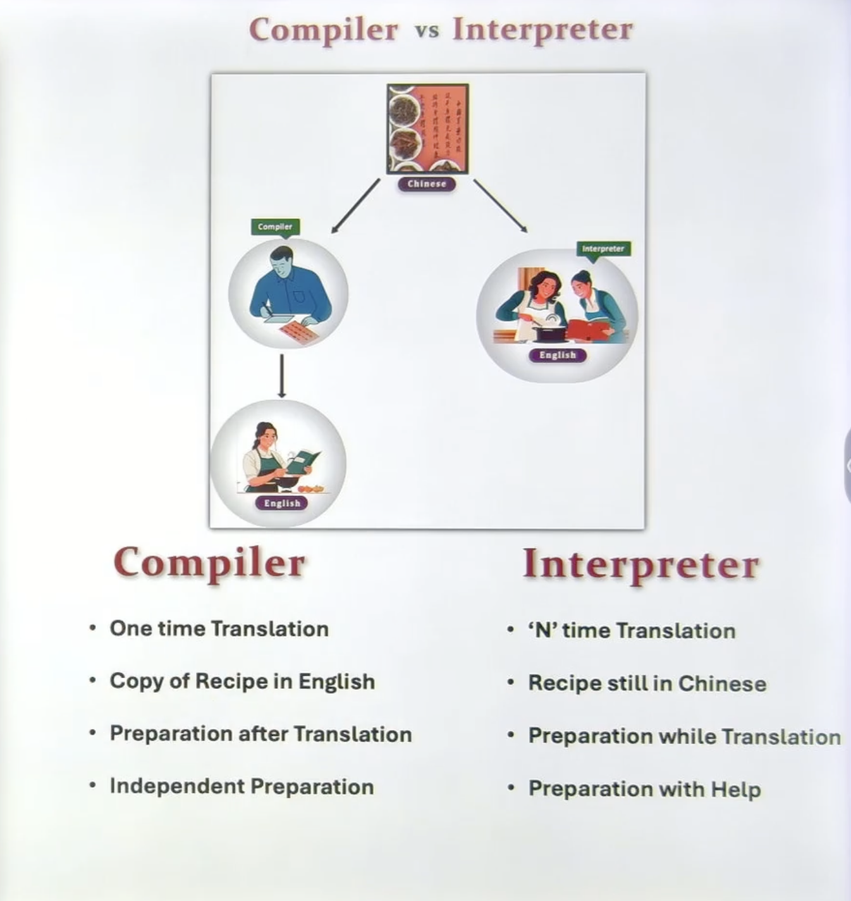
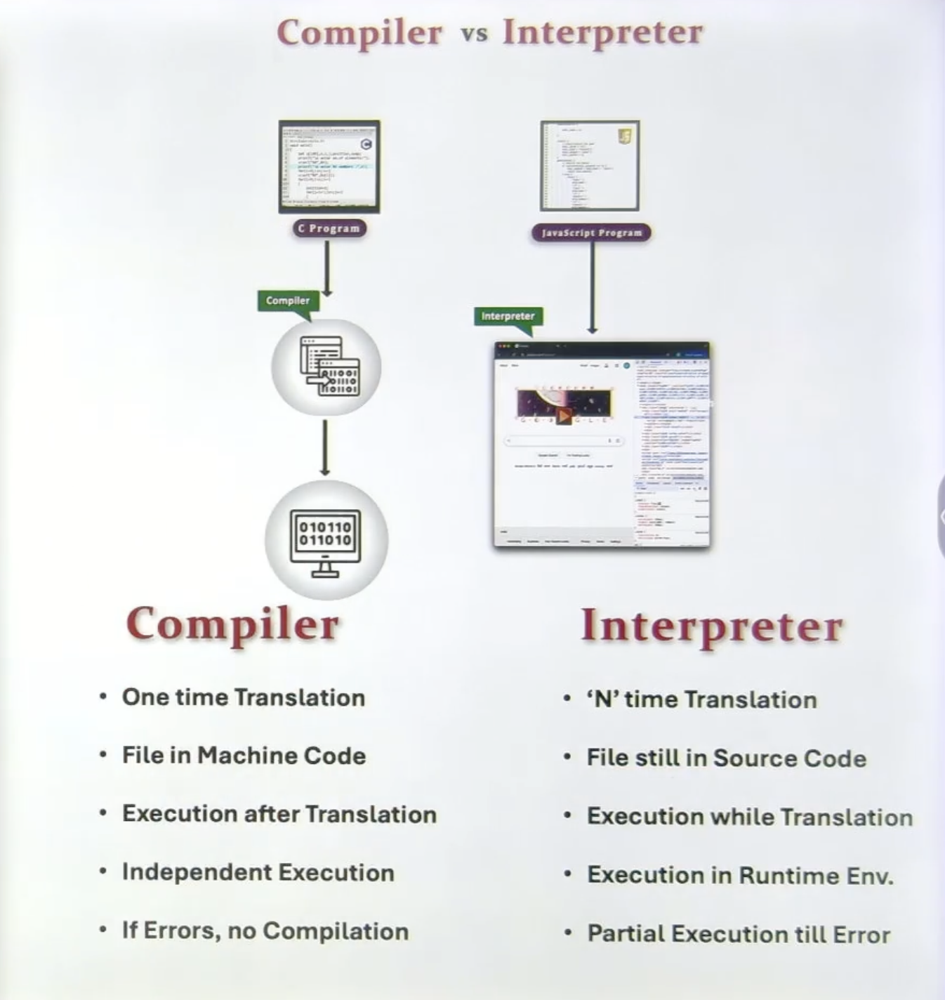

Short Notes  
- Simple and easy  
- Interpreted language  
- Scripting Language  
- General-purpose programming language :  Desktop app, web apps, Games, Data Science, Machine Learning, Artificial Intelligence, Scientific Computing, and more.  
- Python is Data Centric language, which means that it is designed to work with data and has built-in support for data manipulation and analysis. It provides powerful libraries such as NumPy, Pandas, and Matplotlib that make it easy to work with data in Python. Additionally, Python's syntax is designed to be easy to read and write, which makes it a popular choice for data scientists and analysts who need to quickly analyze and visualize data.  
- As python is scrting language, it is used to write small programs called scripts.  
- It is used for web development, data analysis, machine learning, artificial intelligence, scientific computing, and more.    
- It has a large standard library and a vast ecosystem of third-party packages and frameworks.  
- It is known for its readability and ease of use, making it a popular choice for beginners and experienced programmers alike.  
- Python is Dynamically typed language, which means that you don't need to declare the type of a variable when you create it. The type of the variable is determined at runtime based on the value assigned to it. This allows for more flexibility in coding, but it can also lead to errors if you're not careful with your variable assignments.  
- Compiled and Interpreted language: Python is an interpreted language, which means that it is executed line by line by the Python interpreter. However, it can also be compiled to bytecode, which can be executed more efficiently. This allows for faster execution of Python code while still maintaining the flexibility of an interpreted language.  
Plaform Independent and portable: Python is a platform-independent language, which means that it can run on any operating system without requiring any modifications to the code. This makes it a popular choice for developers who want to create applications that can run on multiple platforms. Additionally, Python is portable, which means that you can easily move your code from one machine to another without worrying about compatibility issues.  

#### Programming Language Types:     
- Low level languages: These are programming languages that are closer to machine code and provide little abstraction from the underlying hardware. Examples include Assembly language and Machine language. Ex: C, C++, Rust, Go, etc.  
- High level languages: These are programming languages that provide a higher level of abstraction from the underlying. Examples include Python, Java, Ruby, etc. 
 - Compiler : C, C++, Rust, Go, etc.    
 - Interpreter : Python, JavaScript, Ruby, etc.  
 - Hybrid : Java, C#, etc.   
- Procedural programming: This is a programming paradigm that focuses on writing procedures or routines that operate on data. It emphasizes the use of functions and procedures to break down a program into smaller, more manageable pieces. Examples of procedural programming languages include C, Fortran, and Pascal.  
- Object-oriented programming: This is a programming paradigm that focuses on the use of objects, which are instances of classes, to represent data and behavior. It emphasizes the use of encapsulation, inheritance, and polymorphism to create reusable and modular code. Examples of object-oriented programming languages include Java, C++, and Python.  
- Functional programming: This is a programming paradigm that focuses on the use of functions to create programs. It emphasizes the use of pure functions, which have no side effects and always return the same output for the same input, to create programs that are easier to reason about and test. Examples of functional programming languages include Haskell, Lisp, and Scala.  
- Scripting programming: This is a programming paradigm that focuses on writing small programs called scripts that automate tasks or perform specific functions. Scripting languages are often interpreted and provide a high level of abstraction, making them easy to use for tasks such as system administration, web development, and data analysis. Examples of scripting languages include Python, Perl, and Ruby.  

#### Compiler vs Interpreter  
- Compiler: A compiler translates the entire source code into machine code or bytecode before execution. It is generally faster in execution but slower in development and debugging. Examples include C, C++, Rust, Go, etc.  
- Interpreter: An interpreter executes the source code line by line without compiling it first. It is slower in execution but faster in development and debugging. Examples include Python, JavaScript, Ruby, etc.  
  
  
#### Python is Hybrid Language.  
- Compiler + Interpreter  
- First.py --> Intermediate Code (python Byte code) first.pyc --> Machine Code (Python Virtual Machine) Runtime Environment.  
- Python code is first compiled to bytecode, which is a low-level representation of the code that can be executed by the Python Virtual Machine (PVM). The bytecode is stored in .pyc files, which are generated automatically when a Python script is executed. The PVM then executes the bytecode, which allows for faster execution of Python code while still maintaining the flexibility of an interpreted language. This hybrid approach allows Python to be both easy to use and efficient, making it a popular choice for a wide range of applications.  
Does python Does compile and interpret for all python code?  
- Yes, all Python code is first compiled to bytecode and then interpreted by the Python Virtual Machine.  
Why need for both compiler and interpreter?  
- The compiler allows for faster execution of Python code by translating it into a low-level representation that can be executed more efficiently. The interpreter allows for greater flexibility and ease of development by allowing developers to write and test code without needing to compile it first. This hybrid approach allows Python to be both easy to use and efficient, making it a popular choice for a wide range of applications.  

#### Python is Platform Independent and Portable  
- Platform Independent: Python can run on any operating system without requiring any modifications to the code. This is because Python code is compiled to bytecode, which can be executed on any platform that has a compatible Python Virtual Machine (PVM). This makes it a popular choice for developers who want to create applications that can run on multiple platforms.  
- Portable: Python code can be easily moved from one machine to another without worrying about compatibility issues. This is because Python code is written in a high-level language that abstracts away many of the details of the underlying hardware and operating system. Additionally, Python has a large standard library and a vast ecosystem of third-party packages and frameworks that are designed to be cross-platform, which further enhances its portability. This makes Python a popular choice for developers who want to create applications that can be easily shared and deployed across different environments.  

#### Programming Paradigms.  
- Procedural programming: This is a programming paradigm that focuses on writing procedures or routines that operate on data. It emphasizes the use of functions and procedures to break down a program into smaller, more manageable pieces. Examples of procedural programming languages include C, Fortran, and Pascal.  
- Object-oriented programming: This is a programming paradigm that focuses on the use of objects, which are instances of classes, to represent data and behavior. It emphasizes the use of encapsulation, inheritance, and polymorphism to create reusable and modular code. Examples of object-oriented programming languages include Java, C++, and Python.  
- Functional programming:(Support Mathematics functions) This is a programming paradigm that focuses on the use of functions to create programs. It emphasizes the use of pure functions, which have no side effects and always return the same output for the same input, to create programs that are easier to reason about and test. Examples of functional programming languages include Haskell, Lisp, and Scala. Due to it vast library python sy=upports many apps in statistics, machine learning, data science, etc.    
- Scripting programming: This is a programming paradigm that focuses on writing small programs called scripts that automate tasks or perform specific functions. Scripting languages are often interpreted and provide a high level of abstraction, making them easy to use for tasks such as system administration, web development, and data analysis. Examples of scripting languages include Python, Perl, and Ruby.    
- Modern programming languages often support multiple paradigms, allowing developers to choose the best approach for their specific use case. For example, Python supports procedural, object-oriented, functional, and scripting programming paradigms, making it a versatile language that can be used for a wide range of applications.  

#### Python Libraries/Modules:  
- NumPy: A library for numerical computing in Python that provides support for arrays, matrices, and mathematical functions.  
- Pandas: A library for data manipulation and analysis in Python that provides support for data frames and series.  
- Matplotlib: A library for data visualization in Python that provides support for creating a wide range of static, animated, and interactive visualizations.  
- Scikit-learn: A library for machine learning in Python that provides support for a wide range of algorithms and tools for data preprocessing, model selection, and evaluation.  
- TensorFlow: A library for machine learning and deep learning in Python that provides support for building and training neural networks.  
- Flask: A micro web framework for Python that provides support for building web applications.  
- Django: A high-level web framework for Python that provides support for building complex web applications.  
- Requests: A library for making HTTP requests in Python that provides support for sending and receiving data over the web.  
- Beautiful Soup: A library for web scraping in Python that provides support for parsing HTML and XML documents.  
- PyTorch: A library for machine learning and deep learning in Python that provides support for building and training neural networks.  
- OpenCV: A library for computer vision in Python that provides support for image and video processing.  
- SQLAlchemy: A library for working with databases in Python that provides support for object-relational mapping (ORM) and SQL queries.  
- Pillow: A library for image processing in Python that provides support for opening, manipulating, and saving image files.  
- PyGame: A library for game development in Python that provides support for creating 2D games and multimedia applications. 
- These are just a few examples of the many libraries and modules available in Python. The Python ecosystem is vast and constantly growing, with new libraries and frameworks being developed all the time to support a wide range of applications and use cases. Whether you're interested in data science, web development, machine learning, or any other field, there is likely a Python library or module that can help you achieve your goals.  
- Desktop Application: PyQt, Tkinter, wxPython, Kivy, etc.  
- Web Development: Flask, Django, Pyramid, etc.  
- Data Science: NumPy, Pandas, Matplotlib, Seaborn, etc.  
- Machine Learning: Scikit-learn, TensorFlow, PyTorch, etc.  
- Artificial Intelligence: TensorFlow, Keras, PyTorch, etc.  
- Scientific Computing: SciPy, NumPy, Matplotlib, etc.
- games: PyGame,Panda3D, Arcade, etc.  
- Database: SQLAlchemy, PyMySQL, Psycopg2, etc.  